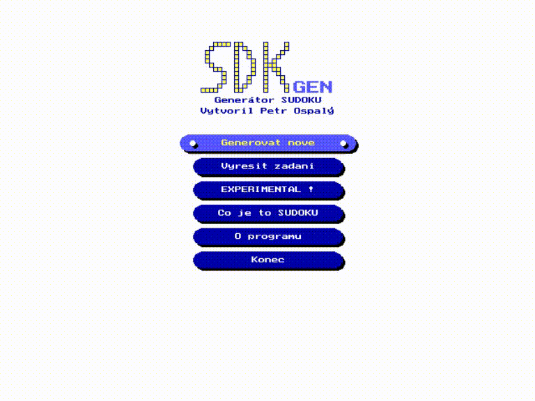
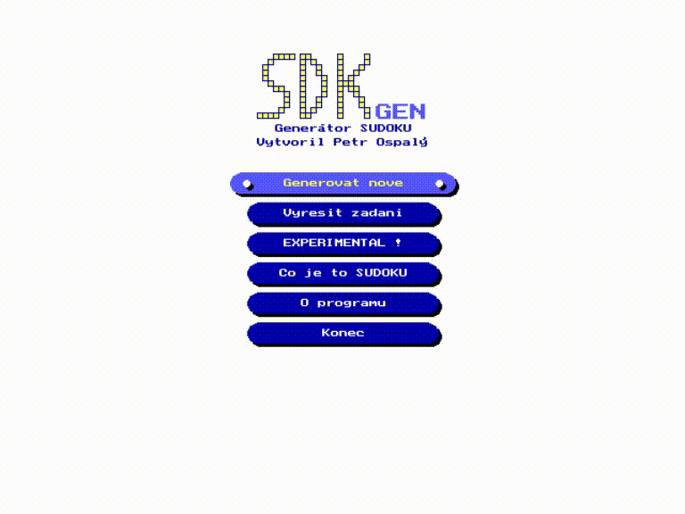

# gympl

This repo contains my silly projects from the time when I was attending the high school (**[Gymnázium, Vídeňská 47](http://www.gvid.cz/)**) where I finished my *Upper Secondary* education. I am keeping these here out of pure nostalgia (Turbo/Borland Pascal, beginning programming experience and for other memories during these life changing years...).

Most of the code I managed to salvage is pure garbage :) I am data junkie so I don't want to delete anything - but in this repo is only stuff which I cherish for some reason.

I may rewrite/refactor/fix some of it in the future and port it so I can build it with **[Free Pascal](https://www.freepascal.org/)**. As of now though the status of the code is as it was during my school years.

So far only the projects below are worthy of keeping, more can be added once I find time to go through the code:

- **Starsdat** (third year project - *"database"* application)
- **SDKgen** (graduation project - Sudoku generator/solver)

**DISCLAIMER:**
Content of this repo is only for my own amusement - the code is horrible and probably buggy (I was really a programming novice then). Also variable names, function names and comments are mix of Czech and English. **You can play with it, but I do not warrant or guarantee anything...**

## Quick Start

Install **[dosbox](https://www.dosbox.com/)** (preffered) or at least **[dosemu](http://www.dosemu.org/)** and then you can use the prepared shell wrapper:

- `% git clone https://github.com/ospalax/gympl.git`
- `% cd gympl`
- `% ./rundos.sh -h`

### dosbox

My student programs ran much smoother and faster in the school setup (MS Windows/DOS environment). Many of those projects which I have written are quite unusable in any dos emulator (text based *"graphics"*). Only the presented here somewhat behave well (using 2D drawing library with EGA/VGA support) - but still you should not try to emulate it on any old hardware.

From manpages of dosbox:

```
At present, dosbox run on a 1.7 Gigahertz PC is roughly the equivalent of a 25MHz 386 PC.
```

Also for reference there is a speed comparison table in the dosbox wiki: [emulated CPU equivalency](https://www.dosbox.com/wiki/Performance#Emulated_CPU_equivalency)

## SDKgen

This is my biggest school project - I wrote it during the third year when the **[Sudoku](https://en.wikipedia.org/wiki/Sudoku)** was all the rage. I actually did not like to solve the puzzles (it was boring and mechanical) but I saw it as a perfect problem to be solved by a computer. I found many tricks to speed up the solver (deterministic elimination methods and my backtrack algorithm) - it was finished in my third year even before my final graduation year. **`SDKgen`** was much more quicker then any competition I tried (opensource and freeware) and also it always delivers a puzzle with exactly one solution - which was not true for the other programs I tested... The code in `dosudoku` is the original codebase (year 2007) before I hacked in to it the save/load feature which is sadly broken as I found out now :)

For many reasons I used it as my graduation project - the teacher just demanded to add a file support - so I did that and graduated. Actually that extra added file feature is the only buggy thing in this application (I just injected it without much testing) - it is very much broken, so **don't store/restore puzzle until I fix it**.

Currently it is exactly the same as it was handed to my teacher - I made only **`dosbox.conf`**, changed email to my current one and relabeled the buggy function in menu to **`EXPERIMENTAL !`**.

### Usage

Make sure that dosbox/dosemu is installed:

```
% ./rundos.sh sdkgen
```

---

### Generate Sudoku



---

### Solve Sudoku



---

## Starsdat

This was the mandatory third year project - making some *database* application. Database is a very fancy word for this silly program doing basic operation on a binary file... I was, if I remember well, the only one implementing the interface in the *real* graphic mode of Turbo/Borland Pascal - the rest of the class was just making yet another text application. And only thanks to that choice I can share it here now because any text based version (simulating UI) would not run well in the emulator.

### Usage

Make sure that dosbox/dosemu is installed:

```
% ./rundos.sh starsdat
```

---

